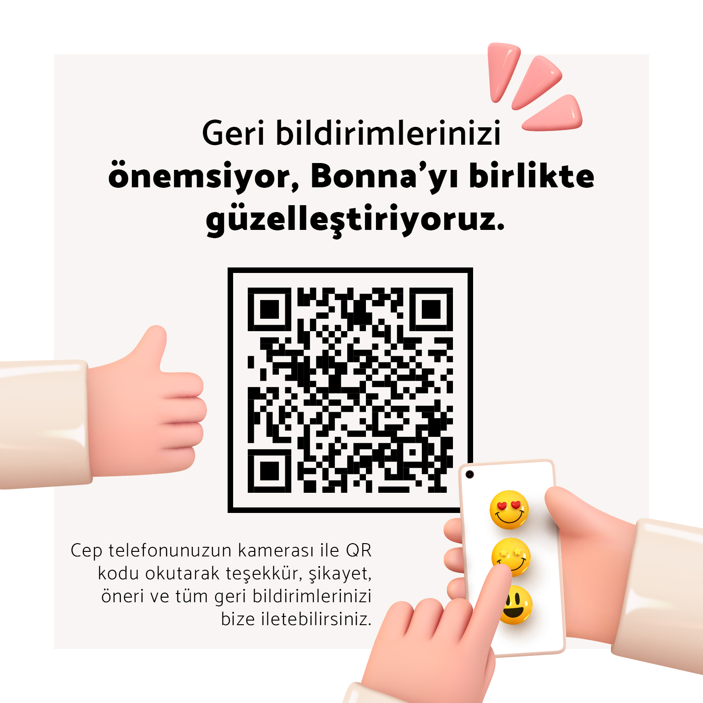
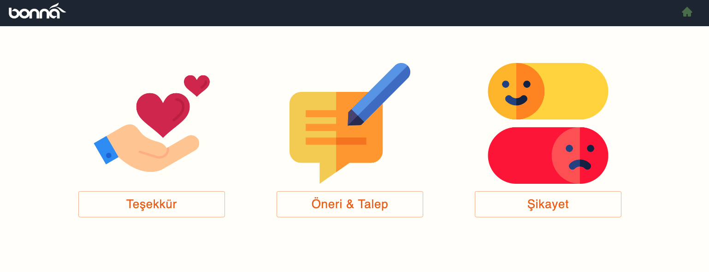
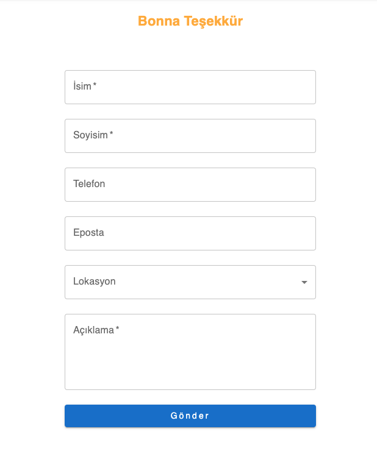

# Bonna Feedback

#### About Project : 
##### Uygulamaya qr kod üzerinden erişim yapılıyor.
##### Uygulama içerisinde kullanıcılar teşekkür, geri bildirim ve şikayet kaydı oluşturabiliyor.
##### Veriler firebase veritabanına kayıt ediliyor.
##### Girilen verilerin kayıtlarına erişmek için bir rapor sayfası mevcut.
##### Firebase veritabanı ile authentication entegrasyonu mevcut.
##### Authentication ile rapor sonuçları görüntülenebilir.
##### Şikayet kayıtları ile işleme alındı veya alınmadı gibi geri bildirim yapılabilir.


## Installation

Install Bonna_Feedback

```bash
  npm install Bonna_Feedback
  cd Bonna_Feedback/current_version folder
  npm install node_modules
  npm start or yarn start or pnpm dev&start
```


## Images


